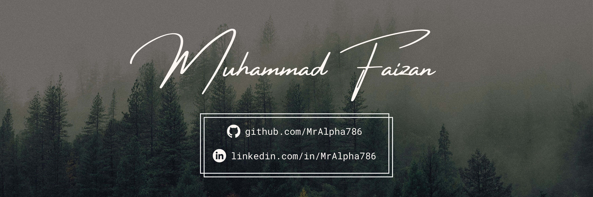

#

My name is Muhammad Faizan. A passionate developer from India. My main areas of interest are web and mobile development. Right now, I'm learning Flutter. Aside from this, I also do graphic design. In my spare time, I enjoy playing chess and reading.

 

# Tech Stack

# Statistics
  
  

#

