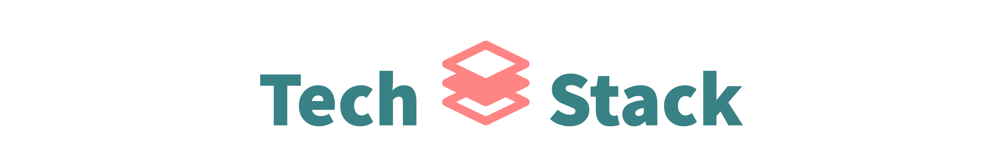
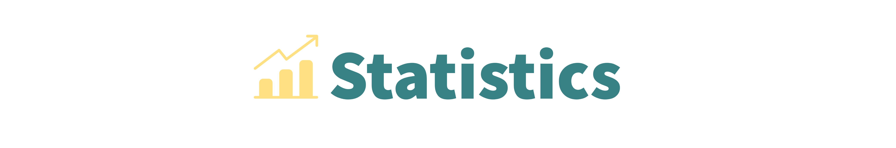
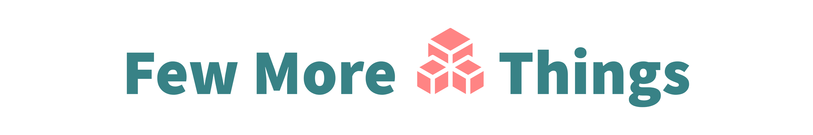

<!-- uncomment to change banner

-->

---

<!--Header: end-->

<!--Social Links Badges: start-->

<!--Social Links Badges: end-->

<!--About me: start-->

My name is Muhammad Faizan. A passionate developer from India. My main areas of interest are web and mobile development. Right now, I'm learning Flutter. Aside from this, I also do graphic design. In my spare time, I enjoy playing chess and reading.

<!--About me: end-->

<!--Tech stack: start-->

<!--Tech stack: end-->

<!--Statistics: start-->

  
  

<!--Statistics: end-->

<!--More Details: start-->

### Currently I'm reading

<!-- CURRENT:START -->
- [The 1-Page Marketing Plan: Get New Customers, Make More Money, And Stand out From The Crowd](https://www.goodreads.com/review/show/6519472170?utm_medium=api&utm_source=rss) by Allan Dib (⭐️4.27)
<!-- CURRENT:END -->

### And these are my top 5 recommendations:

<!-- TOP-FIVE:START -->
- [Cosmos](https://www.goodreads.com/review/show/5185708367?utm_medium=api&utm_source=rss) by Carl Sagan (⭐️4.38)
- [Atomic Habits: An Easy & Proven Way to Build Good Habits & Break Bad Ones](https://www.goodreads.com/review/show/5163920324?utm_medium=api&utm_source=rss) by James Clear (⭐️4.35)
- [Superior: The Return of Race Science](https://www.goodreads.com/review/show/5185724578?utm_medium=api&utm_source=rss) by Angela Saini (⭐️4.23)
- [The Courage to Be Disliked: How to Free Yourself, Change your Life and Achieve Real Happiness](https://www.goodreads.com/review/show/5163912949?utm_medium=api&utm_source=rss) by Ichiro Kishimi (⭐️3.95)
- [Behave: The Biology of Humans at Our Best and Worst](https://www.goodreads.com/review/show/5163914631?utm_medium=api&utm_source=rss) by Robert M. Sapolsky (⭐️4.41)
<!-- TOP-FIVE:END -->

<!--More Details: end-->

<!--Footer: start-->

---

